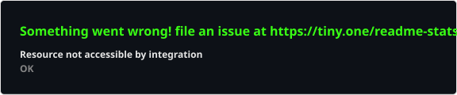

<div align="center">


<br/>

<a href="https://linkedin.com/in/ritikprajapat"></a>
<a href="https://ritikprajapat.netlify.app"></a>
<a href="https://ritikprajapat.medium.com/"></a>
<a href="https://x.com/Ritikp_04"></a>
<a href="https://instagram.com/ritik.grp"></a>

</div>

<br/>

```
─────────────────────────────────────────────────────────────────
 ritikprajapat-taurus:~$ cat about.log
─────────────────────────────────────────────────────────────────
```

- `[ROLE]` Software Engineer I @ Taurus LLC — promoted up from Flutter Developer
- `[ALSO]` Concurrently building at Mocha Technologies India
- `[LEAD]` Leads a 5-person mobile dev team — code reviews, mentoring, goal-setting
- `[STACK]` 3+ yrs shipping production Flutter across FinTech, InsurTech, Property Management
- `[EDU]` Computer Engineering (Diploma) — VIVA College of Diploma Engineering & Technology
- `[SIDE]` UI/UX design + web builds in React / Next.js / Tailwind, Figma-to-code
- `[IDLE]` Anime, and talking anyone's ear off about new tech

<sub>↓ pinned repos are just below this profile on GitHub — scroll to see what I've actually shipped</sub>

<br/>

```
─────────────────────────────────────────────────────────────────
 ritikprajapat-taurus:~$ cat tech_stack.yaml
─────────────────────────────────────────────────────────────────
```

<details open>
<summary><b>Mobile & Frontend</b></summary>
<br/>


</details>

<details>
<summary><b>Backend, Cloud & DevOps</b></summary>
<br/>


</details>

<details>
<summary><b>Languages</b></summary>
<br/>


</details>

<details>
<summary><b>Design</b></summary>
<br/>


</details>

<br/>

```
─────────────────────────────────────────────────────────────────
 ritikprajapat-taurus:~$ ./fetch_stats.sh --self-hosted
─────────────────────────────────────────────────────────────────
```

<!--
  These three cards are generated by .github/workflows/update-cards.yml
  (self-hosted GitHub Action, same "commit into the repo" pattern the
  snake animation below already uses) — no external live-render server,
  so no more DEPLOYMENT_PAUSED breakage. They'll go live the moment
  that workflow runs once. See setup notes at the end of this file.
-->
<div align="center">




<br/>


</div>

<br/>

```
─────────────────────────────────────────────────────────────────
 ritikprajapat-taurus:~$ ls achievements/
─────────────────────────────────────────────────────────────────
```

<div align="center">


</div>

<br/>

```
─────────────────────────────────────────────────────────────────
 ritikprajapat-taurus:~$ cat contributions.log
─────────────────────────────────────────────────────────────────
```

<div align="center">

</div>

<br/>

<div align="center">


</div>

<br/>

<details>
<summary><sub><b>⚙ one-time setup note (delete this block once done)</b></sub></summary>

The stats/langs/streak cards above read from `./profile/*.svg` in this repo — generated locally by GitHub Actions instead of a shared live-render server, since the public `github-readme-stats` / `github-readme-streak-stats` demo instances have been intermittently paused (rate-limit/cost issues on the maintainers' side, not fixable from this end).

1. Add `.github/workflows/update-cards.yml` (included alongside this README).
2. In repo **Settings → Actions → General → Workflow permissions**, select **Read and write permissions**.
3. Go to the **Actions** tab → run the workflow once manually. It'll commit `profile/stats.svg`, `profile/langs.svg`, and `profile/streak.svg`, and re-run daily after that.
4. The trophy card points at the official `github-profile-trophy.vercel.app` service — the previous community mirror this pointed to (`github-profile-trophy-winning.vercel.app`) is dead (404).

</details>
